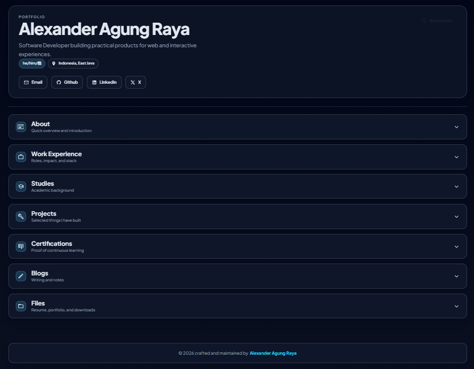

# alexanderar.com

Portfolio of Alexander Agung Raya — Software Developer.



## Stack

- [TanStack Start](https://tanstack.com/start) (React 19 + TanStack Router, fully prerendered to static HTML)
- Tailwind CSS 4
- TanStack Query — silent client-side refresh for the GitHub sections
- Markdown content (`src/content/**`) rendered at build time with the unified toolchain
- Cloudflare Workers static assets deployment

## Content

- **Blogs** — `src/content/blogs/*.md` (frontmatter: `title`, `date`, `description`, `tags`).
  Posts can also be created from GitHub issues via the *Issue to Blog Post* workflow.
- **Projects** — `src/content/projects/*.md` (frontmatter: `title`, `year`, `description`,
  `fullDescription`, `image`, `projectLink`, `repoLink`, `technologies[{name, icon, docLink}]`).
- **Security reports** — `src/content/reports/*.md`.
- **GitHub data** — `scripts/fetch-github.mjs` snapshots merged PRs + the contribution
  calendar into `src/data/github.json` at build time and nightly
  (see *Refresh GitHub Data* workflow); the site then refreshes client-side with a 24h cache.

## Develop

```bash
bun install
bun run dev        # http://localhost:3000
```

## Build & deploy

```bash
bun run build      # fetch GitHub snapshot + generate OG images + typecheck + prerender
bun run deploy     # build + wrangler deploy (serves ./dist/client via Workers assets)
```

Prerendered output lives in `dist/client/`; `wrangler.jsonc` points the Worker's
assets at that folder and serves `404.html` for unknown paths.

Deploys are automatic: every push to `master` runs the *Build & Deploy Static Site*
workflow (GitHub Actions), which builds the site and runs `wrangler deploy` against
the Worker `alexanderar-site` (custom domains `alexanderar.com` / `www.alexanderar.com`)
using the `CLOUDFLARE_API_TOKEN` / `CLOUDFLARE_ACCOUNT_ID` repository secrets.
Manual deploys still work from a machine with a Wrangler login: `bun run deploy`.
