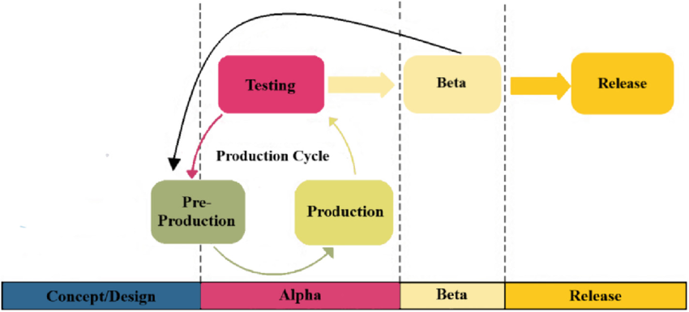

### **Introduction**
 

**Hello**, I'm excited to share my journey and the experiences I've had so far. I hope you enjoy reading this and find it inspiring.
 
 

 
 
So, the Game Development Life Cycle, or GDLC, is a series of stages from design to development of a game. Generally, the GDLC consists of six main stages: initialization, pre-production, production, testing, beta release, and the full version. A game developer has a very important role in their field, as developing game applications for mobile, platforms, PC, or the web requires them to be able to create games that meet the expectations of their audience. Therefore, it is crucial for developers to follow these GDLC stages to ensure the quality of the games they develop. Now, I will explain the various stages within the Game Development Life Cycle (GDLC) that I mentioned above.
 
 

### **Chapter 1**: Phase One: Initiation    
At this stage, the game concept will be developed, involving an analysis of what the overall game will be like; the initiation phase will produce a game concept and a simple description. This phase will also outline the game scenario, characters, storyline, player goals, the platform to be used, and the game engine.

### **Chapter 2**: Phase Two: Pre-production    
Next, you will develop your Game Design Documents. From the initiation stage output, you need to explain your core and detail the concept at this stage. Sometimes, people create prototypes at this stage.

### **Chapter 3**: Phase Three: Production    
After developing the game design and prototype, you must complete your games from preproduction into full production to fulfill your primary target. In this stage, your team will develop asset creation, programming, services integration, if any, and other production things.

### **Chapter 4**: Phase Four: Testing    
Fourth, you will do internal testing on your build from production. Usually, you need to test out the usability and functionality. Is it aligned with your game design already? If you find a bug / that needs to be fixed, you will go back to the preproduction/production phase until all of it has been fixed.

### **Chapter 5**: Phase Five: Beta Release    
The next one is beta testing. Usually, I call this External Testing. You will gain a lot of feedback from your targeted users. It's so important to hear out your users because we often, as developers, do not realize something that is discovered by our users. Sometimes, this stage will bring you back to the production phase again.

### **Chapter 6**: Phase Six: Full Release    
Finnaly After your game passes the testing and beta testing phase, it's a sign that it is ready to release on the game marketplace. You need to decide which platform is aligned with your game market and mechanics from the initial phase.
